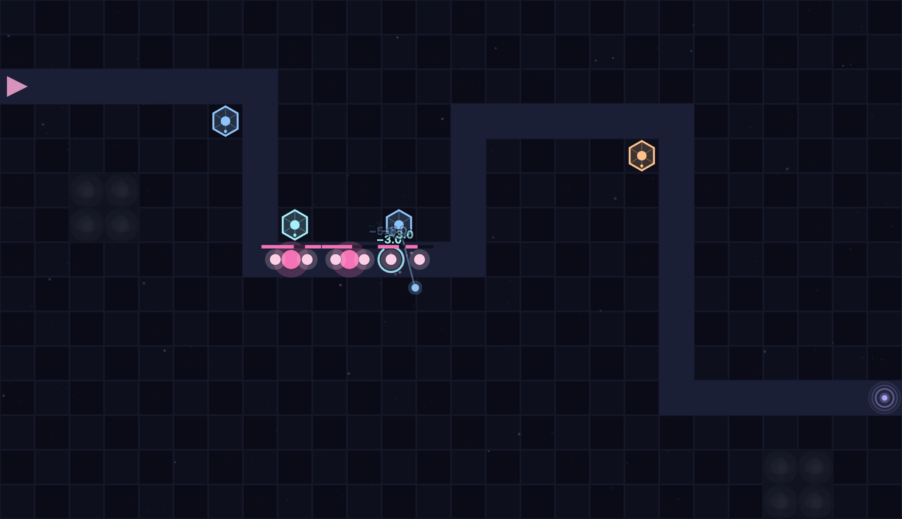
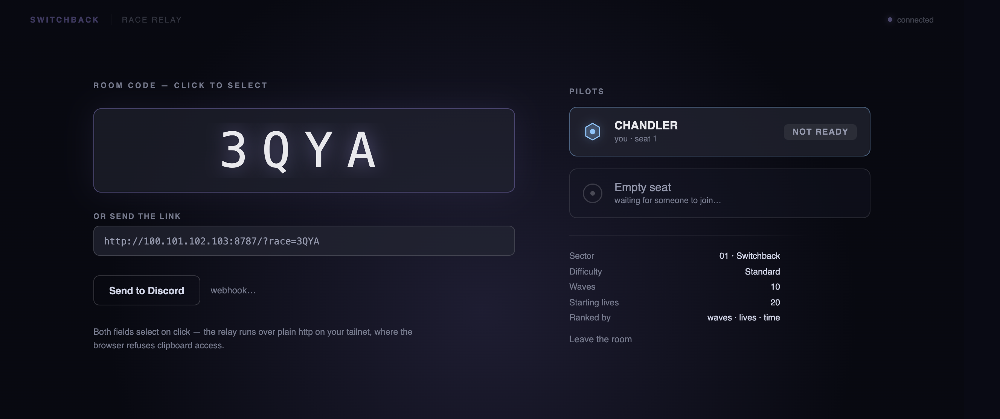
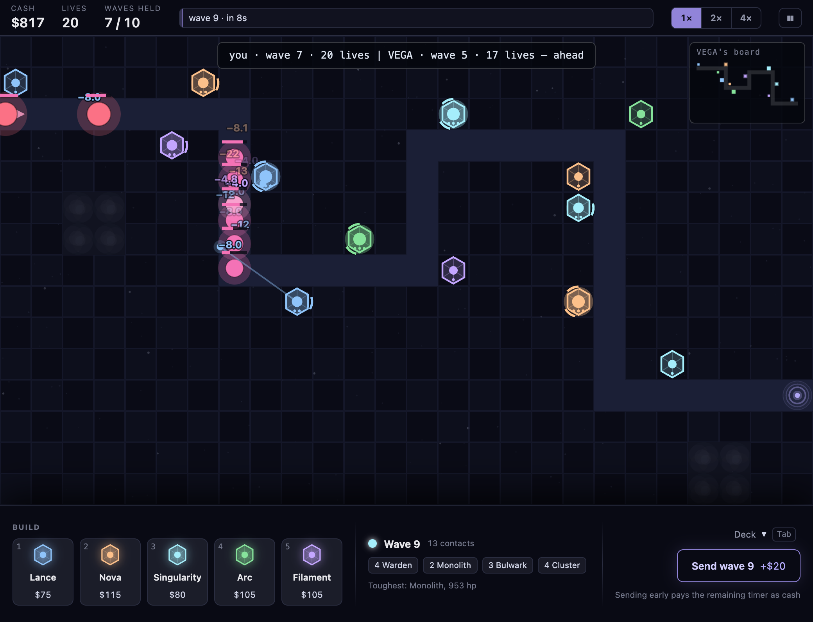
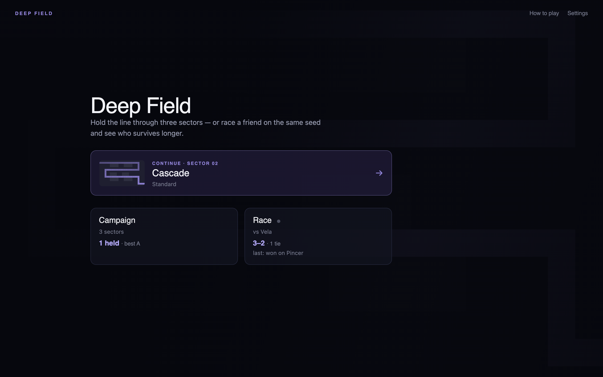
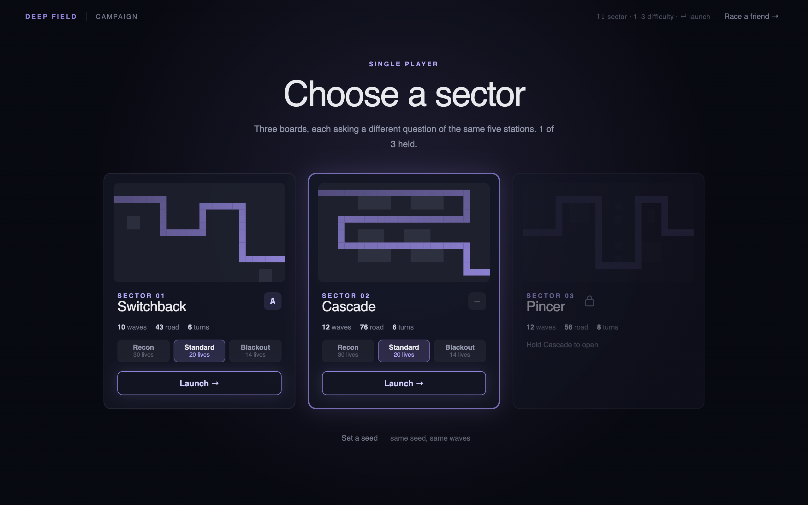
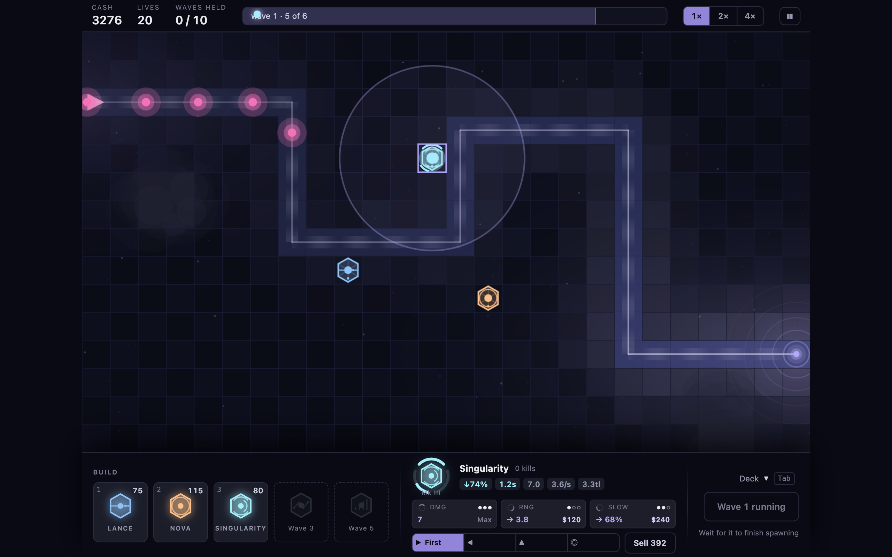

# Deep Field — Discord Activity

> **This is the Activity experiment, not the game's home.** The finished,
> playable Deep Field lives at
> [cbhead/deep-field-td](https://github.com/cbhead/deep-field-td); this repo
> forked from it at `1e2469a` and is porting it to run inside a Discord voice
> channel via the Embedded App SDK. All seven gaps in
> [docs/DISCORD-ACTIVITY.md](docs/DISCORD-ACTIVITY.md) are closed, and as of
> 2026-08-31 the activity launches and signs a player in for real. To run it,
> follow [docs/RUNBOOK-activity.md](docs/RUNBOOK-activity.md). What has *not*
> happened yet is two people racing each other inside a voice channel.
>
> Upstream is wired up as a remote, so sim and balance fixes still flow down:
> `git pull upstream main`. Everything below this line describes the game as it
> works **today** — over Tailscale, unchanged from upstream. It stays accurate
> until the port actually lands, and each section gets rewritten as the thing it
> describes is replaced.

A tower defense game for your browser — hold the line through an eight-sector
campaign, race a friend head-to-head on the same seed, or fight one directly in
**Versus**, where the contacts on your board are the ones they paid to send.



Five station types across eight sectors, 94 waves in all, at three difficulty
tiers. The simulation is deterministic: a seed fixes every wave's composition
and timing, which is what makes a fair race possible in the first place.

The first three boards — Switchback, Cascade and Pincer — each run one road, and
they ask where the longest stretch you can afford to cover is. The last five ask
a different question, because a map carries **routes, plural**: Fork splits a
wave in two around a blocked centre, Delta sends armour up one road and numbers
up the other, Braid swaps its lanes at every rung so nothing stays lined up,
Sluice runs a 20-tile chute against a 50-tile coil so one wave arrives twice,
and Crown runs four lanes into a strong point that covers exactly half of them.

## Someone sent me an invite link

You don't need to download anything. You need two things:

1. **Tailscale** — a free app that puts your computer on your friend's private
   network. [Download it](https://tailscale.com/download), then sign in using
   the invite your friend sent you (they'll send it from their Tailscale admin
   page).
2. **The invite link** — it looks like `http://100.x.y.z:8787/?race=ABCD`, or
   `?versus=ABCD` if they're hosting a fight rather than a race. Open it in
   your browser once Tailscale is running.

Type a name, hit **Ready**, and you're racing. That's it — no Node, no
terminal, no cloning.

If the page won't load: your Tailscale isn't connected, or your friend's
server isn't running. Ask them to check both.

## I want to host a match

You'll need:

- **macOS or Linux** (Windows: use [WSL](https://learn.microsoft.com/windows/wsl/install)) with `zsh` installed
- **Node.js 20.19 or newer** — [nodejs.org](https://nodejs.org) (the repo's `.nvmrc` says 22; nvm users are handled automatically)
- **A [Tailscale](https://tailscale.com) account**, with your friend invited to
  your tailnet (Tailscale admin console → **Invite users**)

Then:

```sh
git clone https://github.com/cbhead/deep-field-td.git
cd deep-field-td
npm install
caffeinate -i npm run play    # macOS: caffeinate keeps the machine awake mid-match
                              # Linux: just `npm run play`
```

The server prints the URL to open — something like
`http://100.x.y.z:8787/?race`. Open it, pick a sector and difficulty, and the
lobby hands you a **room code** and a ready-made **invite link**:



Send the link to your friend — click to select, then copy, or paste a Discord
webhook once and use **Send to Discord**. Both fields are select-on-click
rather than copy buttons on purpose: over Tailscale the page is plain http,
which isn't a secure context, so the browser refuses clipboard access.

When you're both **Ready**, a three-second countdown runs and the race starts
on a shared seed.

> If port 8787 is already taken, `PORT=8790 npm run play` moves the whole
> thing — page and relay together — and the lobby's invite link follows the new
> port automatically.

Something not working? The
[match night runbook](docs/RUNBOOK-match-night.md) has step-by-step
verification and a troubleshooting table.

### What a race looks like

Both pilots get identical waves. You see their standing — wave, lives, elapsed
time, and a minimap of the stations they've built — but never their board:



Runs are ranked on waves cleared, then lives kept, then time. Lose your
connection and you can reclaim the same seat and carry on; walk away and it's a
forfeit after 90 seconds.

## Versus — Front Line

Race is a comparison: two people playing the same arc, side by side, seeing who
lasts. **Versus is a fight.** You spend money to put contacts on the other
person's board, and they spend money putting contacts on yours.

```sh
npm run play          # then open the URL with ?versus instead of ?race
```

Everything from Race carries over — room codes, the invite link, resume,
forfeit. The lobby hands out a `?versus=CODE` link so your friend lands in the
same game you're hosting.

**One board, and it's half a corridor.** Midfield is the left edge, your core is
the right. The neutral wave appears at midfield on the shared seed and walks at
both of you — it's a third party, pressing equally, and it never takes sides.
Two lanes, *Crest* and *Trough*, the same 33 tiles long and a different shape:
Crest turns five times and rewards splash, Trough runs one fourteen-tile
straight and rewards reach. Neither answers the other, so the question a sortie
asks is which of their two defences is thinner.

**The era ladder.** Stations aren't unlocked by a clock here — you buy them.

| Era | Stations | Upgrades to | Can send |
|---|---|---|---|
| I | Lance, Nova, Singularity | Mk I | Drifter, Mote |
| II | + Arc, + Overclock | Mk II | + Warden, Cluster |
| III | + Filament | Mk III | + Monolith, Bulwark |

One purchase does two things: it opens new stations *and* raises the upgrade
ceiling on everything already standing. While you're banking for the next rung
you're building nothing — that gap is the whole tension, and it's when the other
side pushes.

**Sending.** Pick a lane, press a contact. It costs a fixed multiple of the
bounty they'll collect for killing it, so:

- **Into a wall** — they kill it, they collect the bounty, and you're down more
  than they're up. Spam is a transfer to the person you're spamming.
- **Into a hole** — it takes lives (a Monolith takes three) and pays you back
  most of the price.

You never see their board, so a warning strip tells you what's coming and which
lane it took. Their era shows in the opponent strip — it's the most useful thing
you can know about someone whose defence is hidden.

**It ends when a core does.** The arc never runs out: composition loops but the
contacts keep compounding, so a fully upgraded defence falls around wave 21 with
nobody attacking at all. There's no clock and no sudden death — the escalation
*is* the terminator.

You can play it solo to learn the economy — `?level=versus` sends your own
sorties straight back at you.

## Single-player campaign

No Tailscale, no friend, no setup beyond the clone:

```sh
npm run play
```

Open <http://localhost:8787>. The home screen picks up where you left off —
Continue resumes the sector you last played, at the difficulty you last used:



Eight sectors, three difficulties — Recon (30 lives), Standard (20), and
Blackout (14 lives and tougher contacts). Each card draws its own board, so you
can see the shape you are choosing rather than read about it; a locked sector
shows its board dimmed rather than hiding it. Difficulty is on the card, so
launching is one click:



Money you finish a sector with carries into the next one.

Every station upgrades along three independent paths, and the board shows which
one you've committed to. Select a station to see what it's actually doing —
damage dealt, kills, and what it does to the contact type currently on the
board:



Progress saves in your browser (localStorage), so use the same browser to
continue a run.

## Developing

```sh
npm run dev         # Vite dev server with hot reload (single-player)
npm run server      # run the race relay separately during development
npm run typecheck   # strict TypeScript, no emit
npm run lint        # ESLint
npm run check       # headless simulation gates — the balance test suite
npm run campaign    # explore the campaign arc headlessly
npm run sweep       # balance sweeps
npm run shots       # re-take the README screenshots (needs `npm run dev` running)
npm run worktree x  # isolated checkout at .claude/worktrees/x, for a second session
```

### Running two sessions at once

Use a worktree. Two sessions in one working tree share an index, a HEAD and a
set of files, and they will quietly wreck each other — in one afternoon a second
session committed onto a branch it did not know it was on, switched the branch
out from under the first mid-task, and pushed a commit the first was still
writing. Nothing was lost, but only because the two happened to be editing
disjoint files.

```sh
npm run worktree audio            # new branch `audio`, checked out in its own tree
npm run worktree fix origin/main  # branch off a specific base
npm run worktree versus           # reuse an existing branch
```

Same repository, same history, same remote; independent index and checkout, so
branching in one moves nothing in the other. `node_modules` is symlinked rather
than reinstalled — 170MB a copy, and one known-good install avoids re-tripping
the stale-npm native-dependency trap below. The script warns if the branch
changes `package.json`, which is the one case that needs its own install.

Give each session its own dev port (`PORT=5174 npm run dev`), but note `PORT`
moves only the dev server: Race mode's client dials a hardcoded default, so the
session hosting a race should keep the default port. Clean up with
`git worktree remove <path>` and `git branch -d <name>`.

The screenshots above are scripted rather than taken by hand — see
`tools/shots.ts`. They went stale the moment the board was rebuilt and nothing
caught it, because a screenshot has no typechecker; making them one command
means they can be refreshed as part of landing a visual change instead of when
somebody remembers. It drives a real Chrome over the DevTools protocol, so the
simulation actually runs, and it fails loudly if a screen it expected is not on
screen. The two race captures are still taken by hand: they need two clients and
a relay between them, and faking that would photograph something the game does
not do.

`npm run play` is the single-port build: it bundles the client and serves both
the page and the WebSocket relay from one process, so the socket follows
whatever port the page came from. The two-process split above is dev-only —
there Vite serves the page while `npm run server` holds the relay on 8787, so
that port is the one case the client has to name explicitly.

The layout: `src/sim/` is the deterministic game simulation (shared by the
browser and the headless tools), `src/render/` draws it with Pixi.js,
`src/ui/` is the HUD and lobby, `src/content/` holds towers/waves/balance
numbers — including `sorties.ts`, the versus send table — `src/net/` is the
wire protocol shared by both head-to-head modes, and `server/` is a small
WebSocket relay that also serves the built client. Design rationale lives in
[docs/design/](docs/design/README.md).

## License

[MIT](LICENSE)
